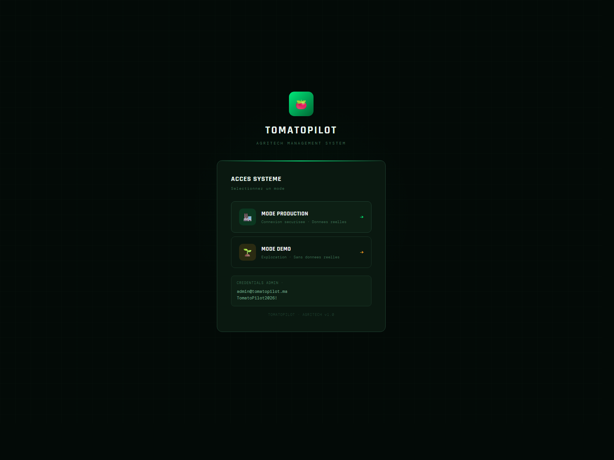
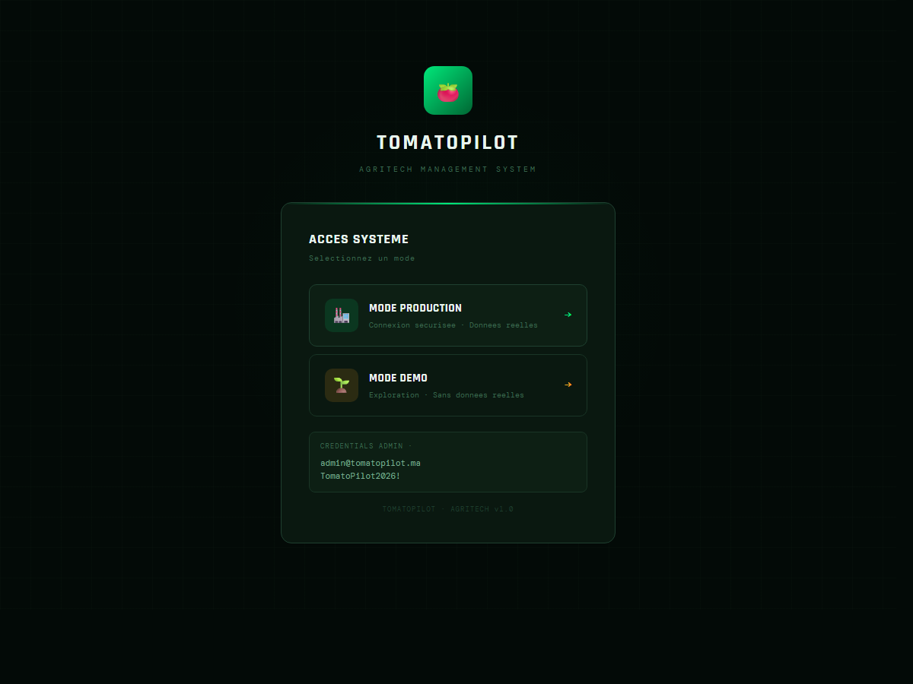
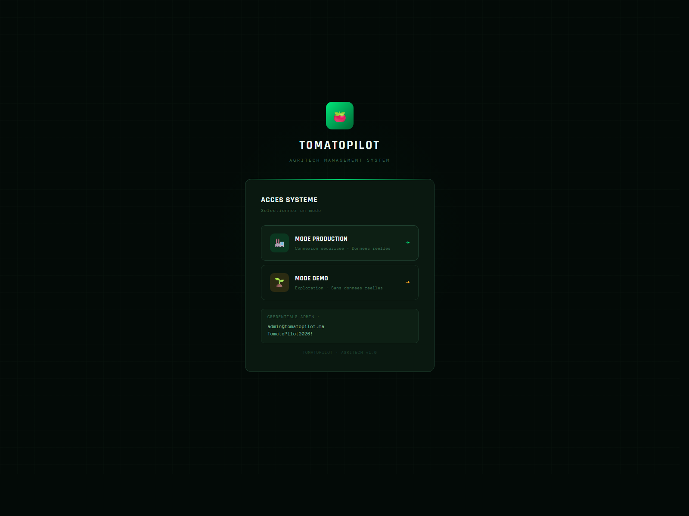

# Guide Utilisateur AgriApp

## 1. Objectif de l'application

AgriApp permet de piloter une exploitation agricole sous serre, depuis la planification de campagne jusqu'au suivi des recoltes, des ventes, des achats, des stocks et de la facturation.

L'application est organisee autour de 5 grandes familles d'usage :

- pilotage
- exploitation
- commerce
- ressources
- finances

## 2. Logique generale d'utilisation

L'ordre recommande pour bien demarrer est le suivant :

1. creer les donnees de base
2. preparer la production
3. suivre les recoltes
4. gerer les ventes et la facturation
5. suivre les achats, stocks et couts

## 3. Mise en route

Avant de saisir des operations, il est conseille de renseigner les elements de reference :

- Fermes
- Serres
- Varietes
- Campagnes
- Clients
- Fournisseurs
- Marches

Ces modules servent de base a presque tous les autres.

## 4. Modules de reference

### Fermes

Ce module permet de creer les exploitations ou sites de production.

Utilisation :

- creer une ferme
- renseigner son code, son nom, sa localisation et sa surface
- les fermes actives sont ensuite proposees dans les campagnes et dans les serres
- le pays par defaut est initialise a `Maroc`

### Serres

Ce module permet de definir les serres rattachees a une ferme.

Utilisation :

- creer chaque serre
- preciser la surface totale et la surface exploitable
- utiliser ces donnees pour la planification de plantation
- la surface exploitable est la reference utilisee dans `Production` pour calculer la disponibilite restante
- une serre peut ensuite etre reliee aux plantations, achats, factures fournisseurs et couts

### Varietes

Ce module centralise les varietes produites.

Utilisation :

- renseigner le nom commercial
- definir le type
- indiquer les rendements et couts theoriques
- le rendement theorique alimente automatiquement la proposition de rendement cible dans `Production`
- la desactivation se fait en pratique via `is_active` plutot que par suppression physique

### Campagnes

Ce module permet de structurer les saisons ou cycles de production.

Utilisation :

- creer une campagne
- definir les dates de plantation, de recolte et de fin
- definir les objectifs de budget et de production
- une nouvelle campagne est creee avec le statut initial `planification`
- les campagnes servent ensuite de pivot dans `Production`, `Recoltes`, `Achats`, `Couts` et `Factures fournisseurs`

## 5. Modules de production

### Production

Ce module permet de planifier les plantations par campagne, serre et variete.

Utilisation :

- selectionner une campagne
- choisir une serre
- choisir une variete
- saisir la surface plantee
- saisir la date de plantation

Controle important :

- l'application verifie que la surface plantee ne depasse pas la surface disponible de la serre
- la surface disponible est calculee comme `surface exploitable - surface deja plantee`
- si une variete est selectionnee, son rendement theorique est repris pour pre-remplir le rendement cible
- l'application calcule automatiquement une `production theorique totale = surface plantee x rendement cible`
- chaque plantation est creee avec le statut `planifie`
- le tableau de suivi affiche aussi la surface restante par serre

### Agronomie

Ce module sert de journal d'interventions culturales.

Utilisation :

- enregistrer les traitements
- enregistrer les irrigations
- enregistrer les fertilisations
- tracer les produits, doses, volumes d'eau, pH, EC et observations

Ce module est utile pour le suivi technique et la tracabilite.

Logique applicative :

- une intervention doit obligatoirement etre rattachee a une plantation existante
- les types geres incluent `traitement`, `irrigation`, `fertilisation`, `taille`, `inspection`, `plantation` et `autre`
- le module permet de saisir en plus les conditions d'execution : temperature, humidite, nombre d'ouvriers, duree et volume d'eau
- les interventions sont restituees par date decroissante avec code couleur par type d'operation

### Recoltes

C'est un module central de l'application.

Il permet de :

- creer une recolte
- dispatcher la recolte par marche
- confirmer les quantites acceptees
- enregistrer les prix
- analyser les freintes et les ecarts

Flux recommande :

1. creer la recolte
2. dispatcher la quantite par marche
3. confirmer les quantites acceptees
4. enregistrer les prix
5. analyser les pertes, freintes et chiffre d'affaires

Le module propose aussi :

- une synthese prix par periode
- une vue confirmes
- une analyse des freintes et des ecarts

Logique applicative :

- a la creation, la quantite de recolte est enregistree dans la categorie 1 et le `lot_number` est genere automatiquement
- une recolte passe ensuite par plusieurs etats de suivi :
- `RECOLTEE` si aucun dispatch n'existe
- `DISPATCHEE` si des dispatches existent sans confirmation de prix
- `PARTIELLEMENT CONFIRMEE` si une partie seulement des dispatches est confirmee
- `CLOTUREE` si tous les dispatches ont ete confirmes
- lors du dispatch, l'application bloque toute quantite demandee superieure a la quantite encore disponible sur la recolte
- la confirmation individuelle ou par periode calcule la quantite acceptee a partir de la freinte et de l'ecart, sauf si une quantite manuelle est saisie
- le chiffre d'affaires confirme est calcule automatiquement comme `quantite acceptee x prix/kg`
- les confirmations alimentent la vue `Confirmes`, la synthese des prix par periode et l'analyse des pertes par marche
- les prix, freintes, ecarts, references station et dates de reception sont sauvegardes dans les metadonnees du dispatch
- il est possible de creer une alerte `journee sans recolte`, ensuite resolvable dans l'onglet `Alertes`

## 6. Modules commerciaux

### Marches

Ce module sert a gerer les debouches commerciaux.

Utilisation :

- creer les marches locaux ou export
- definir la devise
- saisir le prix moyen, les couts logistiques et les frais export
- la devise du marche est reutilisee automatiquement dans `Commandes` quand un marche est selectionne
- les marches servent aussi de destination de dispatch dans `Recoltes`

### Clients

Ce module centralise les acheteurs.

Utilisation :

- creer un client
- definir ses coordonnees
- renseigner ses conditions de paiement
- definir un plafond de credit si besoin
- les clients actifs sont reutilises dans `Commandes` et `Factures`
- le delai de paiement est conserve dans la fiche client meme si la date d'echeance reste actuellement saisie dans la facture

### Commandes

Le module `Commandes` sert a enregistrer la demande client avant facturation.

Logique metier :

1. le client passe une commande
2. la commande est creee
3. la commande evolue de `brouillon` a `livree`
4. la facture client peut ensuite etre emise

Lien avec la facturation :

- une facture peut etre rattachee a une commande
- aujourd'hui, la facturation peut encore etre saisie directement sans passer par `Commandes`
- l'ideal est de relier a terme `Commandes -> Livraison -> Facturation`

Logique applicative actuelle :

- la commande enregistre aujourd'hui l'en-tete commercial : client, marche, campagne, devise, dates et notes
- le numero de commande est genere automatiquement au format `CMD-annee-xxxxx`
- le statut initial est `brouillon`
- les statuts disponibles sont `brouillon`, `confirme`, `en_preparation`, `expedie`, `livre`, `facture` et `annule`
- le changement de statut se fait directement depuis la liste
- les montants `subtotal` et `total_amount` sont actuellement crees a `0`, ce qui signifie que les lignes de commande detaillees ne sont pas encore gerees dans l'ecran

## 7. Modules finances

### Factures

Le module `Factures` distingue maintenant :

- le credit clients
- le debit fournisseurs

#### Credit clients

Permet de :

- creer les factures de vente
- suivre les encaissements
- visualiser les echeances
- identifier les retards

#### Debit fournisseurs

Permet de :

- creer les factures fournisseurs
- suivre les reglements
- visualiser les echeances a payer

#### Fonctions de pilotage disponibles

- synthese encaissements vs paiements
- suivi creances vs dettes
- calendrier mensuel des echeances
- releve des prochaines echeances

Logique applicative :

- l'ecran se divise en deux vues distinctes : `Credit clients` et `Debit fournisseurs`
- le statut reel d'une facture est calcule automatiquement selon le montant total, le montant deja regle et la date d'echeance :
- `paye` si le solde est nul
- `en_retard` si la facture n'est pas soldee et que l'echeance est depassee
- `partiellement_paye` si un paiement existe mais que le solde reste positif
- `en_attente` dans les autres cas
- les paiements sont controles avant validation : impossible de saisir un montant nul, negatif ou superieur au reste a encaisser ou a regler
- un paiement client cree une ecriture dans `payments_received`
- un paiement fournisseur cree une ecriture dans `payments_made`
- la page propose des filtres par client ou fournisseur et par statut
- la synthese de tresorerie additionne les encaissements clients et les paiements fournisseurs pour produire un solde net
- le calendrier mensuel affiche les echeances sous forme de points, y compris les jours visibles du mois adjacent
- le relevé des echeances liste les factures ouvertes de la periode visible avec type, numero, compte et montant restant

### Couts

Le module `Couts` sert a enregistrer les couts reels et budgetaires.

Utilisation :

- selectionner une campagne
- selectionner une serre si necessaire
- choisir une categorie de cout
- saisir le montant et la date
- choisir s'il s'agit d'un cout reel ou previsionnel
- le champ `is_planned` permet de distinguer budget et realise
- les couts peuvent etre filtres par campagne

### Achats

Le module `Achats` sert a gerer les bons de commande fournisseurs.

Utilisation :

- choisir un fournisseur
- associer l'achat a une campagne ou une serre
- definir la categorie
- suivre le statut du bon de commande

Logique applicative actuelle :

- le numero de bon est genere automatiquement au format `BC-annee-xxxxx`
- le statut initial est `brouillon`
- la commande peut etre rattachee a une campagne, a une serre, ou aux deux
- la categorie d'achat est obligatoire et sert a orienter ensuite le suivi des couts
- comme pour `Commandes`, les montants sont initialises a `0` car les lignes detaillees ne sont pas encore gerees dans cet ecran

## 8. Modules ressources

### Fournisseurs

Ce module centralise la base fournisseurs.

Utilisation :

- creer les fournisseurs
- definir la categorie
- renseigner les coordonnees
- definir les delais de paiement
- les fournisseurs actifs sont reutilises dans `Achats` et `Factures`
- la devise par defaut est initialisee a `MAD`

### Stocks

Ce module sert a suivre les articles en stock.

Utilisation :

- creer un article
- definir sa categorie et son unite
- definir un seuil d'alerte
- enregistrer les mouvements d'entree et de sortie

Usage recommande :

- utiliser les stocks pour les intrants, emballages et consommables
- surveiller les alertes de stock bas

Logique applicative :

- un article est cree avec un stock initial a `0`
- le code article peut etre genere automatiquement
- les mouvements possibles sont `entree`, `sortie` et `ajustement`
- chaque mouvement met a jour immediatement le stock courant de l'article
- la valeur du stock affichee dans le tableau est calculee comme `stock courant x cout unitaire`
- une alerte visuelle apparait quand `stock courant <= seuil minimum`
- point d'attention : dans la version actuelle, l'ecran ne bloque pas encore une sortie qui ferait passer le stock en negatif

## 9. Lecture du tableau de bord

Le dashboard permet une lecture rapide de l'activite.

Vous y trouvez selon la configuration :

- KPI globaux
- production
- chiffre d'affaires
- couts
- statut des factures
- top serres
- tendances par periode
- filtres dynamiques par mois, semaine ou periode personnalisee
- graphiques de tendance production / couts / chiffre d'affaires
- repartition des factures par statut et analyse des couts par categorie

Il est recommande de l'utiliser comme vue de pilotage et non comme ecran principal de saisie.

## 10. Bonnes pratiques d'utilisation

- creer d'abord les donnees de reference avant de saisir les operations
- garder des noms et codes coherents
- associer les operations aux bonnes campagnes
- enregistrer les recoltes avant la facturation
- utiliser `Factures` pour distinguer clairement clients et fournisseurs
- verifier regulierement les echeances et les retards
- controler les stocks avant les achats urgents

## 11. Flux metier recommande

### Flux production

1. creer la campagne
2. creer les plantations dans `Production`
3. saisir les interventions dans `Agronomie`
4. enregistrer les recoltes dans `Recoltes`

### Flux commercial

1. creer le client
2. creer la commande
3. suivre la livraison
4. creer la facture client
5. enregistrer l'encaissement

### Flux achats

1. creer le fournisseur
2. saisir le bon de commande
3. enregistrer la facture fournisseur
4. enregistrer le reglement
5. rattacher si besoin les couts et les stocks

## 12. Points d'attention

- certaines fonctionnalites restent encore en cours de structuration, notamment autour du lien complet entre commandes, livraisons et factures
- les modules `Alertes`, `Marges` et `Analytique` peuvent etre partiellement neutralises selon la version en cours
- les modules `Commandes` et `Achats` gerent aujourd'hui surtout les en-tetes des documents, sans lignes detaillees ni calculs complets de totaux
- la logique de `Stocks` met bien a jour les quantites, mais un controle preventif sur les sorties negatives reste recommande

## 13. Support interne

En cas de doute, il est recommande de verifier :

- que les donnees de reference existent
- que la campagne est bien selectionnee
- que les dates de saisie sont coherentes
- que les factures non soldes apparaissent dans les echeances

## 14. Resume rapide

Si vous deviez retenir un parcours simple :

1. parametrer fermes, serres, varietes, campagnes
2. planifier dans `Production`
3. suivre dans `Agronomie`
4. enregistrer dans `Recoltes`
5. vendre via `Commandes` et `Factures`
6. gerer `Achats`, `Fournisseurs`, `Stocks` et `Couts`
